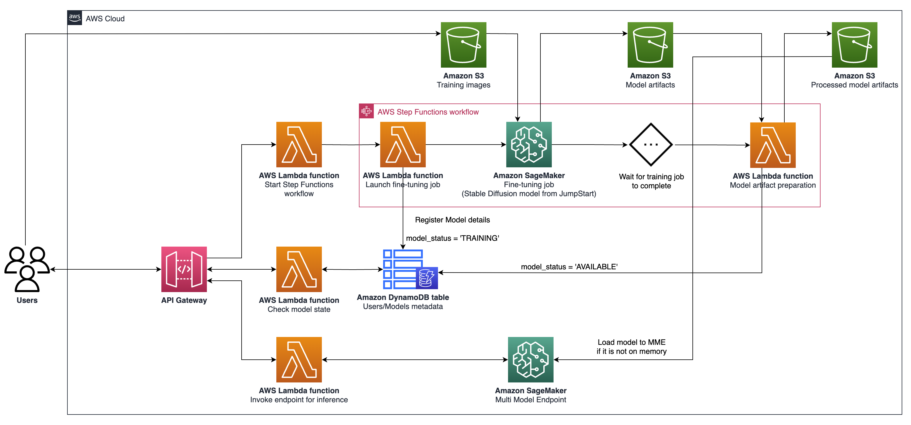

# Architect personalized generative AI SaaS applications on Amazon SageMaker
This project leverages generative AI models to create high-quality data, such as text, images, music, and videos. We address the needs of SaaS providers and B2C startups looking to scale quickly. We propose an architecture based on Amazon SageMaker to streamline AI model fine-tuning and deployment, enabling faster development, improved service quality, and cost-effectiveness. For more details, please refer to [this blog post](https://aws.amazon.com/blogs/machine-learning/architect-personalized-generative-ai-saas-applications-on-amazon-sagemaker/).
## Setup Requirements

* Node 18+
* Install CDK with npm `npm install -g aws-cdk`
* Install Poetry: `https://python-poetry.org/docs/#installation`

Poetry install Linux, macOS, Windows (WSL)

```bash
curl -sSL https://install.python-poetry.org | python3 -
```

Install dependencies with poetry

```
poetry install
```

Setup python env in shell

```
poetry shell
```

At this point you can now synthesize the CloudFormation template for this code.

```
$ cdk synth
```

To add additional dependencies, for example other CDK libraries, just use `poetry add yourpackage`

## Useful Commands

 * `cdk ls`          list all stacks in the app
 * `cdk synth`       emits the synthesized CloudFormation template
 * `cdk deploy`      deploy this stack to your default AWS account/region
 * `cdk diff`        compare deployed stack with current state
 * `cdk docs`        open CDK documentation

## Architecture

The architecture described involves a system for generative AI use cases, with a focus on text-to-image generation as an example. The key components of this architecture are as follows:

**SageMaker Training and Hosting APIs**: These APIs provide fully managed training jobs and model deployment capabilities. They enable fast-moving teams to concentrate more on product features and differentiation. SageMaker Training jobs, which follow a "launch-and-forget" paradigm, are suitable for transient concurrent model fine-tuning jobs during user onboarding.

**GPU-Enabled Hosting**: SageMaker supports GPU-enabled hosting options for deploying deep learning models at scale. This includes the integration of NVIDIA Triton Inference Server into the SageMaker ecosystem. SageMaker also offers GPU support for multi-model endpoints, allowing the deployment of thousands of deep learning models behind a single endpoint, ensuring scalability, low-latency, and cost-effectiveness.

**Infrastructure Level**: At the infrastructure level, the architecture relies on high-performance compute options, such as the G5 instance type equipped with NVIDIA A10g GPUs, which is unique to AWS. This instance type offers a favorable price-performance ratio for both model training and hosting, delivering efficient compute power per dollar spent.

The architecture is particularly well-suited for text-to-image generation use cases. It divides the solution workflow into two major phases:

**Phase A (User Onboarding)**: In this phase, a custom, fine-tuned model is created for each new user as they onboard the system.

**Phase B (On-Demand Inference)**: After fine-tuning, the model is ready for real-time image generation on demand by end-users.



## How to Call the API Gateway with Postman

To interact with your API Gateway deployed using AWS CDK, follow these steps:

1. Open Postman and import the collection from the folder ```documentation```.

2. Set the request method (e.g., GET, POST) and enter the API Gateway URL endpoint.

3. If your API requires authentication, configure the necessary headers or tokens.

4. Add any required request parameters or data.

5. Click "Send" to make the request and receive the response.

   Note: Ensure that your AWS resources and API Gateway are correctly configured to handle the request.
